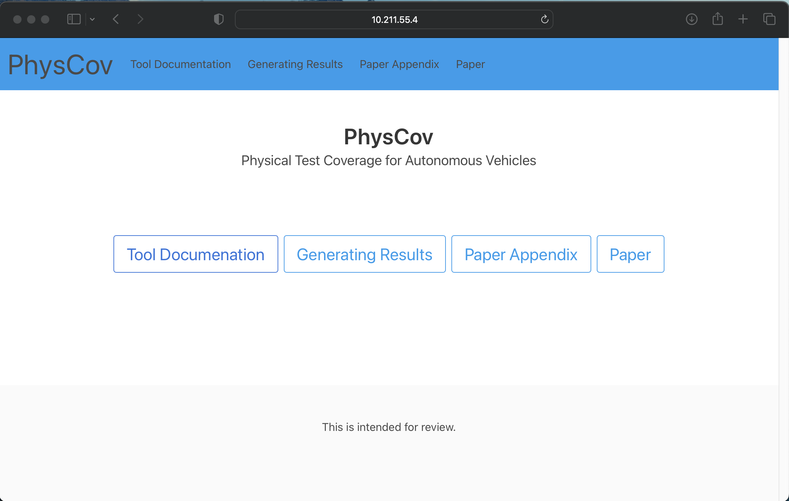

# PhysCov: Physical Test Coverage for Autonomous Vehicles Artifact

## Prerequisites

To run this you will need to have the following installed:
* Docker
* Docker-compose

## Running

From this directory run:
```bash
docker-compose build
```

Then launch the web documentation.

```bash
docker-compose up -d webdocs
```

This will launch a website that contains both the paper as well as the documentation on how to run our artifact. You can visit the website by opening your webbrowswer and visiting:  `127.0.0.1:8000`

The website should look as follows:


The website includes documentation on how to use the tool. Generate the results found in the paper, and includes additional results which we could not include in the paper due to space limitation.

To get started with running our artifact run this in the terminal:
```bash
docker-compose run physcov
```

## Shutting down

To stop everything you need to run the following:
```
docker-compose stop
```